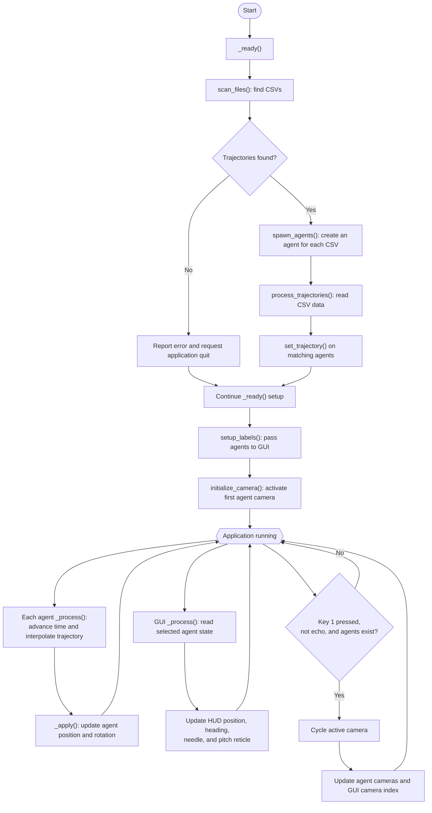

# High-Level Activity Diagram

Based on `main.gd`, `agent.gd`, and `ui_manager.gd`.

```mermaid
flowchart TD
    Start([Start]) --> Ready["_ready()"]
    Ready --> Scan["scan_files(): find CSVs"]
    Scan --> Valid{"Trajectories found?"}

    Valid -- No --> Error["Report error and request application quit"]
    Valid -- Yes --> Spawn["spawn_agents(): create an agent for each CSV"]

    Error --> Setup["Continue _ready() setup"]
    Spawn --> Load["process_trajectories(): read CSV data"]
    Load --> Assign["set_trajectory() on matching agents"]
    Assign --> Setup

    Setup --> Labels["setup_labels(): pass agents to GUI"]
    Labels --> Camera["initialize_camera(): activate first agent camera"]
    Camera --> Running{{"Application running"}}

    Running --> AgentFrame["Each agent _process():<br/>advance time and interpolate trajectory"]
    AgentFrame --> Apply["_apply(): update agent position and rotation"]
    Apply --> Running

    Running --> GuiFrame["GUI _process(): read selected agent state"]
    GuiFrame --> Hud["Update HUD position, heading,<br/>needle, and pitch reticle"]
    Hud --> Running

    Running --> Input{"Key 1 pressed,<br/>not echo, and agents exist?"}
    Input -- No --> Running
    Input -- Yes --> Switch["Cycle active camera"]
    Switch --> UpdateCameras["Update agent cameras and GUI camera index"]
    UpdateCameras --> Running
```
